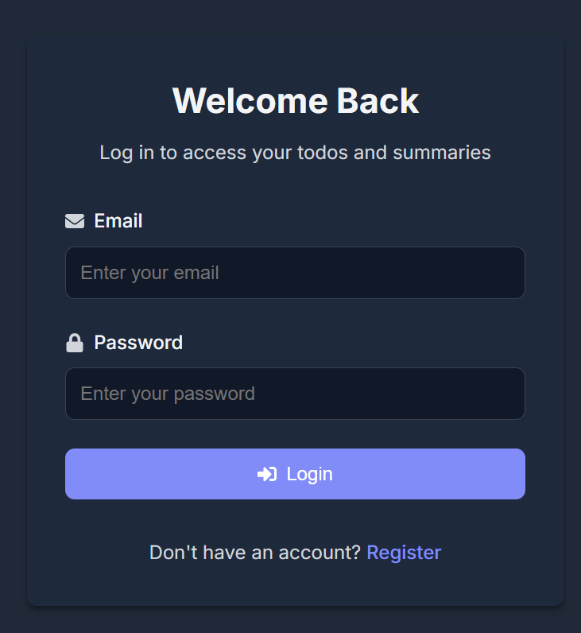
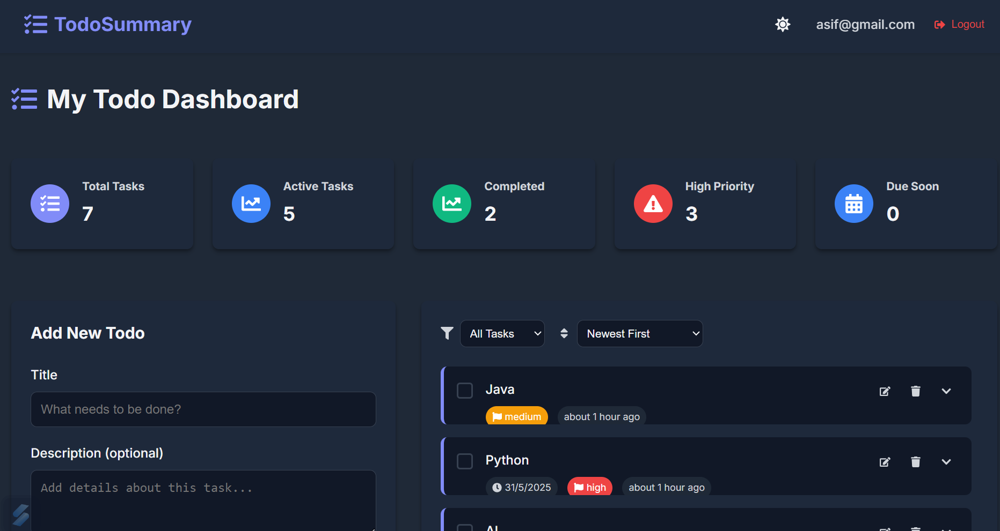
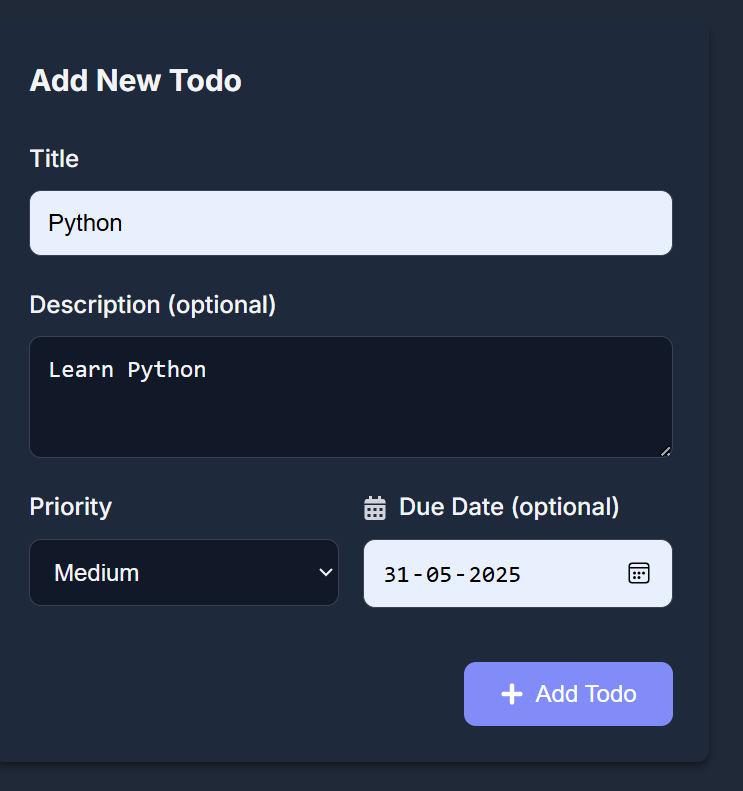

---

# Todo Summary Assistant

A full-stack application that lets users create and manage their to-dos, generate AI-powered summaries using Gemini, and send those summaries to a Slack channel.

---

## Features

* User authentication (login/register)
* Add, edit, and delete to-do items
* View a list of current to-dos
* Generate an AI-powered summary of pending to-dos using Google Gemini
* Send the generated summary to a Slack channel
* Responsive, clean, and interactive UI with notifications

---

## Tech Stack

**Frontend:**

* React (Vite)
* Firebase Authentication
* React Router
* React Icons, React Hot Toast
* Date-fns
* Context API

**Backend:**

* Node.js with Express
* Firebase Admin SDK (Firestore)
* Google Gemini AI for summarization
* Slack Incoming Webhooks
* MVC architecture

---

## Setup Instructions

### Prerequisites

* Node.js (v14 or higher)
* Firebase account
* Google AI Studio account (for Gemini API key)
* Slack workspace with incoming webhook

---

### Firebase Setup

1. Go to [Firebase Console](https://console.firebase.google.com/) and create a new project.

2. Enable **Authentication** with Email/Password method.

3. Create a **Firestore database**.

4. Generate Firebase Admin SDK Service Account key:

   * Go to **Project Settings > Service accounts**
   * Click **Generate new private key**
   * Download the JSON file and **save it as `serviceAccountKey.json` in the root of the `server` directory** (do not commit this file to your GitHub repo)

5. Create a `.env` file in the `server` directory and add:

   ```bash
   GOOGLE_APPLICATION_CREDENTIALS=./serviceAccountKey.json
   ```

6. Add a Web App in your Firebase project and copy the config to `client/src/firebase/config.js`.

---

### Gemini API Setup

1. Go to [Google AI Studio](https://makersuite.google.com/).

2. Create an API key for Gemini.

3. Add your Gemini API key to the backend `.env` file as:

   ```
   GEMINI_API_KEY=your_gemini_api_key_here
   ```

---

### Slack Setup

1. Open your Slack workspace.

2. Create a new Slack App or use an existing one.

3. Go to **Incoming Webhooks** and activate them.

4. Create a new webhook URL for the desired channel.

5. Copy the webhook URL and add it to your backend `.env` file as:

   ```
   SLACK_WEBHOOK_URL=https://hooks.slack.com/services/your/webhook/url
   ```

---

### Installation

Clone the repository and install dependencies:

```bash
git clone https://github.com/AsifMohd01/Todo-with-LLM-and-Slack.git
cd  TODO
```

#### Frontend

```bash
cd client
npm install
```

#### Backend

```bash
cd ../server
npm install
```

---

### Running the Application

Start the backend server:

```bash
cd server
npm run dev
```

Start the frontend server (in a new terminal window):

```bash
cd client
npm run dev
```

Open [http://localhost:5173](http://localhost:5173) in your browser to access the app.

---

## Usage Screenshots

### 1. Login




---

### 2. Register


---

### 3. Dashboard




---

### 4. Todo List View


*Manage your todos: add, edit, and delete items.*

---

### 5. Add Todo


*Create a new todo with a title and description.*

---

### 6. Summary Generation


*Click the button to generate an AI-powered summary of your pending todos.*

---

### 7. AI-Agent


*View the success/failure message when the summary is sent to Slack.*

---

### 8. Slack Notification


*View the success/failure message when the summary is sent to Slack.*

---

## Environment Variables (.env files)

**Backend `.env` example (`server/.env`):**

```bash
PORT=5000
FIREBASE_DATABASE_URL=https://your-project-id.firebaseio.com
GOOGLE_APPLICATION_CREDENTIALS=./serviceAccountKey.json
GEMINI_API_KEY=your_gemini_api_key_here
SLACK_WEBHOOK_URL=https://hooks.slack.com/services/your/webhook/url
```

**Frontend `.env` example (`client/.env`):**

```bash
VITE_FIREBASE_API_KEY=your_firebase_api_key
VITE_FIREBASE_AUTH_DOMAIN=your_project.firebaseapp.com
VITE_FIREBASE_PROJECT_ID=your_project_id
VITE_FIREBASE_STORAGE_BUCKET=your_project.appspot.com
VITE_FIREBASE_MESSAGING_SENDER_ID=your_sender_id
VITE_FIREBASE_APP_ID=your_app_id
```

---

## Troubleshooting

### Firebase Initialization Errors

* Ensure the `serviceAccountKey.json` file is placed in the `server` root and the path in `.env` (`GOOGLE_APPLICATION_CREDENTIALS=./serviceAccountKey.json`) is correct.
* Do not commit `serviceAccountKey.json` to version control.
* Restart your backend server after changing environment variables.

---


