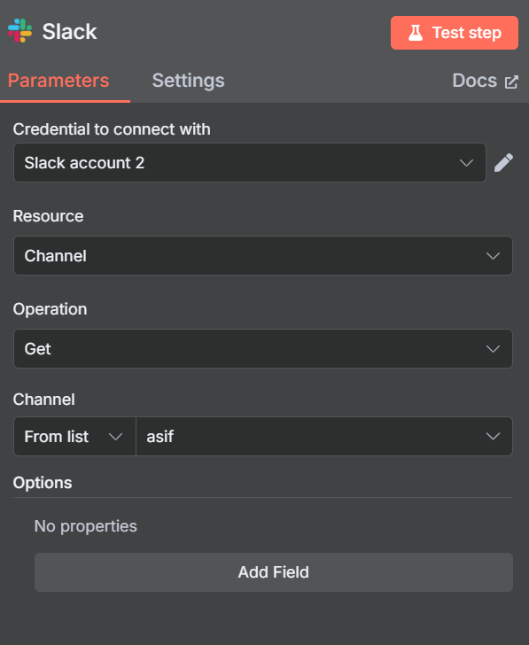
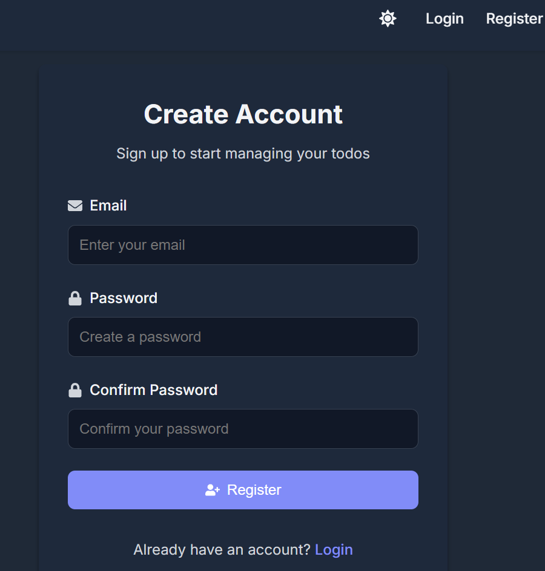
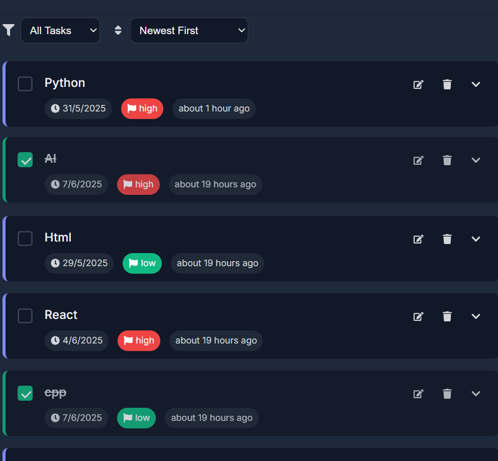
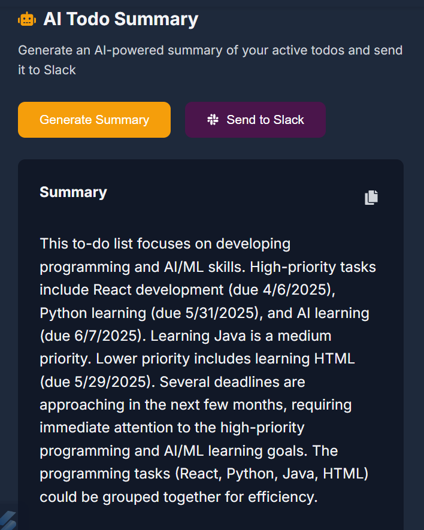

---

# ✅ Todo Summary Assistant

A full-stack, AI-powered to-do management system that lets users add, edit, and delete tasks, generate AI summaries using Gemini, and send those summaries to Slack using an AI agent built with **n8n**.

---

## 🚀 Features

* 🔐 User authentication (login/register)
* 📝 Add, edit, and delete to-do items
* 📋 View a list of current to-dos
* 🤖 Generate an AI-powered summary using **Google Gemini (models/gemini-1.5-flash)**
* 💬 Send the generated summary to a selected **Slack channel**
* ⚙️ AI Agent built with **n8n** workflow
* 📡 Slack channel selection via `GET` route in **n8n**
* 📱 Responsive, clean UI with toast notifications

---

## 🛠 Tech Stack

### Frontend

* React (Vite)
* Firebase Authentication
* React Router
* React Icons, React Hot Toast
* Date-fns
* Context API

### Backend

* Node.js + Express
* Firestore (Firebase Admin SDK)
* Google Gemini API
* Slack Incoming Webhooks
* MVC structure

### AI & Automation

* n8n (open-source workflow automation)
* Google Gemini (`models/gemini-1.5-flash`)
* Slack Integration via Webhook and API

---

## ⚙️ Setup Instructions

### 🔗 Prerequisites

* Node.js v14+
* Firebase account
* Google AI Studio account (Gemini API)
* Slack workspace with webhook access
* n8n instance (cloud or local)

---

### 🔧 Firebase Setup

1. Go to [Firebase Console](https://console.firebase.google.com/)

2. Create a project and enable:

   * **Authentication** → Email/Password
   * **Cloud Firestore** → Start in test mode

3. Generate service account:

   * Project Settings → Service accounts → Generate new private key
   * Save it as `server/serviceAccountKey.json`

4. Create a `.env` file inside the `server` folder:

```bash
GOOGLE_APPLICATION_CREDENTIALS=./serviceAccountKey.json
FIREBASE_DATABASE_URL=https://your-project-id.firebaseio.com
```

---

### 🤖 Gemini API Setup

1. Go to [Google AI Studio](https://makersuite.google.com/)
2. Generate your API Key
3. Add this to `server/.env`:

```bash
GEMINI_API_KEY=your_gemini_api_key_here
```

Model used: `models/gemini-1.5-flash`

---

### 💬 Slack Setup

1. Create a Slack App ([https://api.slack.com/apps](https://api.slack.com/apps))
2. Enable **Incoming Webhooks**
3. Create webhook for your desired channel
4. Add to `server/.env`:

```bash
SLACK_WEBHOOK_URL=https://hooks.slack.com/services/your/webhook/url
```

---

### 🧠 AI Agent with n8n

The backend uses a **custom AI Agent** built with [n8n](https://n8n.io/) that:

#### 🧩 Flow Structure:

1. **Webhook Trigger**
2. **Function Node** → Extracts text
3. **LLM Node (Gemini)** → Uses prompt input from Slack message
4. **Slack Node** → Sends summary to selected Slack channel
5. **Slack Channels API (GET)** → Lists channels for user selection

#### 📥 Prompt Used:

```bash
{{ $json.body.blocks[3].text.text }}
```

This prompt takes the 4th block of Slack's `blocks` array (the user input block).

---

### 📸 AI-Agent Workflow Images

#### 🔄 Full Flow Overview


#### 🔄 Slack Channel GET Node



---

## 📂 Installation

```bash
git clone https://github.com/AsifMohd01/Todo-with-LLM-and-Slack.git
cd Todo-with-LLM-and-Slack
```

### 🔧 Frontend

```bash
cd client
npm install
```

### 🔧 Backend

```bash
cd ../server
npm install
```

---

## ▶️ Running the App

### 🖥 Backend

```bash
cd server
npm run dev
```

### 🌐 Frontend

```bash
cd client
npm run dev
```

Open in browser: [http://localhost:5173](http://localhost:5173)

---

## 🌟 Usage Screenshots

### 1. Login Page


### 2. Register Page



### 3. Dashboard


### 4. Todo List



### 5. Add Todo


### 6. Summary Generator



### 7. AI-Agent Trigger from Slack


---

## 🔐 Environment Variables

### Backend `.env` (`server/.env`)

```bash
PORT=5000
FIREBASE_DATABASE_URL=https://your-project-id.firebaseio.com
GOOGLE_APPLICATION_CREDENTIALS=./serviceAccountKey.json
GEMINI_API_KEY=your_gemini_api_key_here
SLACK_WEBHOOK_URL=https://hooks.slack.com/services/your/webhook/url
```

### Frontend `.env` (`client/.env`)

```bash
VITE_FIREBASE_API_KEY=your_firebase_api_key
VITE_FIREBASE_AUTH_DOMAIN=your_project.firebaseapp.com
VITE_FIREBASE_PROJECT_ID=your_project_id
VITE_FIREBASE_STORAGE_BUCKET=your_project.appspot.com
VITE_FIREBASE_MESSAGING_SENDER_ID=your_sender_id
VITE_FIREBASE_APP_ID=your_app_id
```

---

## 🛠 Troubleshooting

### Firebase Errors

* Ensure the `serviceAccountKey.json` file exists in `server/`
* Verify `GOOGLE_APPLICATION_CREDENTIALS` path in `.env`
* Restart server after changes

### Slack Errors

* Confirm webhook URL is correct
* Channel must allow incoming webhooks

### Gemini API

* Use correct model: `models/gemini-1.5-flash`
* Check your token usage quota in [Google AI Studio](https://makersuite.google.com/)

---

## 👨‍💻 Author

**Asif Mohd**
B.Tech CSE | Full-Stack Developer | AI Workflow Builder
📍 Jammu & Kashmir
🌐 [GitHub - AsifMohd01](https://github.com/AsifMohd01)

---


